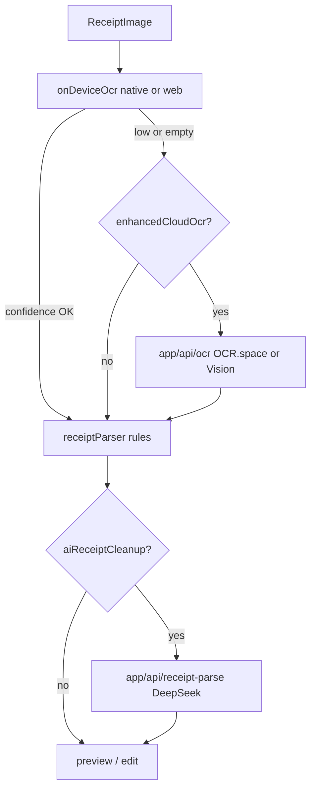

# GroceryFlow / SmartCart Architecture

## Overview

SmartCart (Grocery Financial System) is a local-first Expo React Native app for grocery receipt scanning, shopping list management, budget tracking, and price intelligence. Data persists on-device via SQLite (native) or AsyncStorage JSON (web).

## Tech Stack

| Layer | Technology |
|-------|------------|
| Framework | Expo SDK 56, React Native 0.85 |
| Routing | expo-router (file-based) |
| State | Zustand stores |
| Storage | expo-sqlite / web JSON fallback |
| Charts | react-native-gifted-charts |
| OCR | ML Kit (native), Tesseract.js (web), OCR.space, optional DeepSeek cleanup |

## Directory Structure

```
app/                    # Screens (expo-router)
  (tabs)/               # Tab navigation: Home, Lists, Scan, Receipts, More
  receipt/              # Receipt flow: preview, edit, manual, link
  settings/             # Profile, budget, notifications
  paywall/              # Pro upgrade
  subscriptions/        # Manage subscription
  insights_pro/         # AI Insights Pro (computed analytics)
  inflation_tracker/    # Personal price index
  marketplace/          # Curated deals
  ...                   # Phase 3 monetization screens

src/
  components/           # Reusable UI (SmartCart-themed)
  services/             # Business logic & data access
  store/                # Zustand stores
  models/               # Types & schema
  theme/smartCart.ts    # Design tokens
  hooks/                # useFeatureGate, etc.
```

## Data Flow

```
User action (scan, save receipt, edit list)
    → Screen / Store
    → storageService (SQLite or web JSON)
    → Side effects:
        - storeService (register stores)
        - crowdsourcedPricingService (anonymized price points)
        - comparison / matching services
    → analyticsService (aggregations on read)
    → UI refresh
```

### Receipt lifecycle

1. **Capture** — Camera or image picker (`scan.tsx` / `scan.web.tsx`)
2. **OCR** — `ocr/ocrProvider.ts` orchestrates on-device OCR then optional cloud fallback
3. **Parse** — `receiptParserStructured.ts` → rule-based draft, optional `receiptParsePipeline.ts` → DeepSeek cleanup
4. **Review** — `receipt/preview.tsx`, `receipt/edit.tsx`, `receipt/manual.tsx`
5. **Save** — `storageService.saveReceipt()` → contributes to community price cache
6. **Link** — Optional link to shopping list → `matchingService` → comparison

## OCR pipeline



| Tier | Module | Platform |
|------|--------|----------|
| On-device | `onDeviceOcr.native.ts` (ML Kit) | iOS / Android dev build |
| On-device | `onDeviceOcr.web.ts` (Tesseract multi-PSM) | Web |
| Cloud fallback | `ocr/cloudVisionProvider.ts` → `app/api/ocr+api.ts` | Web + native when `EXPO_PUBLIC_OCR_API_URL` set |
| Rule parse | `receiptParser.ts`, `receiptParserStructured.ts` | All |
| AI cleanup | `receiptParsePipeline.ts` → `app/api/receipt-parse+api.ts` | Web + native when `EXPO_PUBLIC_RECEIPT_PARSE_API_URL` set |

### Native ML Kit testing (dev build required)

ML Kit does **not** run in Expo Go or web preview. Use a development build:

```bash
npm install
npx expo run:ios
# or
npx expo run:android
```

Scan a real receipt with the camera tab. You should see **Extracted via On-device (ML Kit)** on the preview screen.

### Enhanced cloud OCR (optional)

**Recommended: OCR.space** (free tier available)

1. Get an API key from [OCR.space](https://ocr.space/ocrapi)
2. Create `.env` in the project root (see `.env.example`):
   ```
   OCR_SPACE_API_KEY=your_key_here
   ```
3. Run web dev server: `npm run web`
4. In app **Settings → Enhanced scan accuracy (cloud)** toggle ON

**Alternative: Google Cloud Vision**

Set `GOOGLE_CLOUD_VISION_API_KEY` instead (used if OCR.space fails or is unset).

For native builds pointing at a deployed API, set `EXPO_PUBLIC_OCR_API_URL=https://your-host/api/ocr`.

**Privacy:** Cloud OCR only runs when the user enables the toggle. Images are sent for text extraction only; structured receipt data stays local after parse.

### AI receipt cleanup (recommended)

Uses **ChatGPT vision** (`gpt-4o-mini` by default) to read the receipt image and extract items, names, and totals.

1. Get an API key from [OpenAI](https://platform.openai.com/api-keys)
2. Add to `.env`:
   ```
   OPENAI_API_KEY=your_key_here
   ```
3. Run web dev server: `npm run web`
4. In app **Settings → AI receipt cleanup** toggle ON (default ON)

Preview shows **AI scan (ChatGPT)** when vision parsing succeeds. Optional fallback: `DEEPSEEK_API_KEY` for text-only cleanup.

**Privacy:** Receipt image is sent to OpenAI when AI cleanup is enabled.

For native builds, set `EXPO_PUBLIC_RECEIPT_PARSE_API_URL=https://your-host/api/receipt-parse`.

### Future receipt APIs (Phase 3 evaluation)

If Vision + parser still miss line items at scale, consider:

| API | Best for | Notes |
|-----|----------|-------|
| AWS Textract AnalyzeExpense | Structured receipt line items | Strong accuracy; AWS setup |
| Veryfi | Fastest receipt JSON integration | SaaS pricing; minimal parser work |
| Google Document AI Expense | Enterprise receipt parsing | Heavier setup than Vision OCR |

Implement as additional providers in `src/services/ocr/` returning `ParsedReceiptDraft` directly.

## Phases

### Phase 1 — Core MVP (36b9931)
- Tab navigation, home dashboard, receipt scan/OCR
- Shopping lists, budget settings, store tracking
- SmartCart UI theme, web SQLite fixes

### Phase 2 — Retention & Trust (86e8323)
- Settings screen, price alerts, store detail pages
- Spending analytics, comparison summaries
- Onboarding, manual receipt entry

### Phase 3 — Monetization & Advanced (current)
- **Subscription foundation** — `useSubscriptionStore`, `featureGateService`, paywall
- **Pro insights** — `getProInsights()`, inflation tracker from receipt history
- **Crowdsourced pricing** — Local aggregate cache, community vs history in cart comparison
- **Monetization screens** — Marketplace, affiliates, cashback, sponsored, enterprise, API
- **Family plans** — Share codes, list JSON export/import
- **Notifications** — `notificationService` (expo-notifications native, in-app web)
- **Usage tracking** — Local stats from storage

## Feature Gating

```typescript
// Pro features checked via featureGateService + useFeatureGate hook
canAccessFeature('insights_pro')  // true when tier === 'pro'
promptUpgrade() → navigates to /paywall
```

Subscription state is mock/local (AsyncStorage). Production would integrate App Store / Play billing.

## Crowdsourced Pricing (Future API)

`crowdsourcedPricingService.ts` implements `ICrowdsourcedPricingProvider`:

- **Local MVP** — `contributeFromReceipt()` on save, `getCommunityPricesForItem()` on read
- **Future** — Replace `localCrowdsourcedProvider` with remote sync; types unchanged

`priceComparisonService` merges: **your history** → **community** → **estimates**

## Key Stores

| Store | Purpose |
|-------|---------|
| `useBudgetStore` | Weekly budget, category limits, onboarding |
| `useSettingsStore` | Display name, notification toggles, enhanced cloud OCR |
| `useListStore` | Shopping lists & items |
| `useScanStore` | OCR draft state |
| `useSubscriptionStore` | Free / Pro tier (local mock) |

## Notifications

- **Native** — `expo-notifications` schedules local alerts for price drops & budget thresholds
- **Web** — In-app notification queue (`subscribeInAppNotifications`)
- Toggles in Settings → `refreshScheduledNotifications()` on save

## Platform Notes

- **Web** — SQLite may fail; `storageService.web.ts` uses AsyncStorage JSON. Default OCR is Tesseract; enable cloud OCR in Settings for better accuracy.
- **Native** — Full SQLite, camera, ML Kit OCR (dev build), push notifications
- **API routes** — `app/api/ocr+api.ts` runs on Expo dev server; static export hosting requires a separate backend or `EXPO_PUBLIC_OCR_API_URL`
- Read Expo v56 docs before changing native modules: https://docs.expo.dev/versions/v56.0.0/
